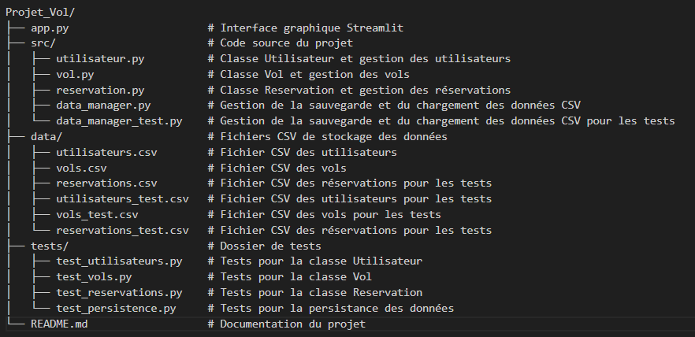

## Système de Réservation de Vols

Un projet de simulation de système de réservation de vols en Python permettant la gestion des utilisateurs, des vols, des réservations et de la persistance des données.

## Structure du projet

## Documentation des Classes

### 1. Classe `Utilisateur`
- **Description** : Cette classe représente un utilisateur du système. Chaque utilisateur a un nom, un âge et un email unique, et peut gérer ses réservations.
- **Attributs** :
  - `nom` : Nom de l'utilisateur.
  - `age` : Âge de l'utilisateur.
  - `email` : Email unique, utilisé comme identifiant.
  - `reservations` : Liste des réservations de l'utilisateur.
- **Méthodes** :
  - `ajouter_utilisateur` : Ajoute un nouvel utilisateur si les champs sont valides (nom, âge, email) et vérifie l’unicité de l’email.
  - `reserver_vol` : Crée une réservation pour un vol, ajoutant cette réservation à la liste des réservations de l'utilisateur.
  - `annuler_reservation` : Annule une réservation spécifique et libère une place pour le vol associé.

### 2. Classe `Vol`
- **Description** : Cette classe représente un vol avec des informations telles que le numéro de vol, la ville de départ, la destination, et le nombre de places disponibles.
- **Attributs** :
  - `numero_vol` : Identifiant unique du vol.
  - `depart` : Ville de départ du vol.
  - `destination` : Ville de destination du vol.
  - `nb_places_disponibles` : Nombre de places restantes pour le vol.
- **Méthodes** :
  - `ajouter_vol` : Ajoute un nouveau vol si le numéro est unique et que tous les champs sont valides.
  - `supprimmer_vol` : supprime un vol.

### 3. Classe `Reservation`
- **Description** : Cette classe représente une réservation pour un vol spécifique, faite par un utilisateur donné.
- **Attributs** :
  - `id` : Identifiant unique de la réservation.
  - `utilisateur` : L'utilisateur ayant effectué la réservation.
  - `vol` : Le vol réservé.
- **Méthodes** :
  - `creer_reservation` : Crée une réservation pour un utilisateur sur un vol, en réduisant le nombre de places disponibles.
  - `annuler_reservation` : Annule une réservation et augmente le nombre de places disponibles sur le vol.

---

## Tests

Les tests vérifient le bon fonctionnement des classes et leurs interactions. Ils sont répartis en plusieurs fichiers, chacun testant une partie spécifique du projet.

- **test_utilisateurs.py** : Tests pour la gestion des utilisateurs, vérifiant la création, la validation, et la gestion des doublons.
- **test_vols.py** : Tests pour l'ajout et la validation des vols, notamment pour l’unicité des numéros de vol et la gestion des places.
- **test_reservations.py** : Tests de réservation et d'annulation, incluant la vérification du nombre de places disponibles et la gestion des réservations existantes.
- **test_persistence.py** : Tests de persistance des données pour s'assurer que les utilisateurs, vols et réservations sont correctement sauvegardés dans les fichiers CSV et rechargés sans perte d’information.

---

## Fonctionnement de la Persistance des Données

Le projet utilise des fichiers CSV pour sauvegarder et charger les données des utilisateurs, vols, et réservations. Le fichier `data_manager.py` gère la persistance en centralisant les fonctions de lecture et d’écriture.

- **Sauvegarde** : Les fonctions `sauvegarder_utilisateurs`, `sauvegarder_vols`, et `sauvegarder_reservations` écrivent les données dans les fichiers CSV correspondants.
- **Chargement** : Les fonctions `charger_utilisateurs`, `charger_vols`, et `charger_reservations` lisent les données depuis les fichiers CSV au démarrage, permettant de recréer l'état précédent du système.

### Fichiers CSV

- **`utilisateurs.csv`** : Contient les informations de chaque utilisateur.
- **`vols.csv`** : Contient les informations de chaque vol.
- **`reservations.csv`** : Associe chaque réservation à un utilisateur et à un vol spécifique.
